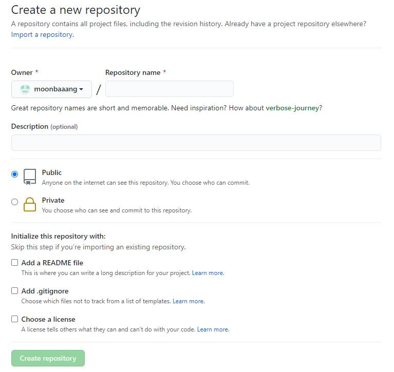
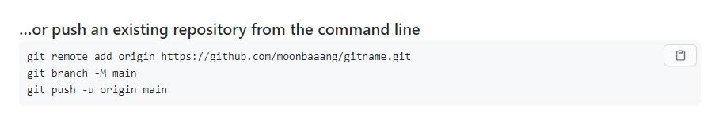

# Github 사용법?

* 저와같이 Github에 처음 입문하시는 분들을 위해 아주 간략하게 정리해보았습니다. 

>  조금 더 자세한 설명을 원하시면 [여기](https://github.com/moonbaaang/TIL) 를 참고해주세요.    


## 1. Git 설치

* [Git 설치 링크](https://git-scm.com/downloads) 를 클릭하시고 본인의 운영체제에 맞게 다운로드합니다.

>  본문은 windows 운영체제를 기준으로 설명합니다.    


## 2. Git init

* Git 설치가 끝나면 commit 할 파일이 있는 디렉토리를 우클릭하여 **Git Bash Here**를 클릭합니다.

```bash
$ git init
```

>  `git init`를 입력하여 로컬저장소(repository)를 설정합니다.

> `.git`디렉토리가 생성되고 여기에 git과 관련된 모든 정보가 저장됩니다.    


## 3. 기본 작업 흐름

> 여기서부터는 아주 간략히 명령어 위주로 설명하겠습니다.  


### 1. add

```bash
$ git add a.txt # a.txt 를 add
$ git add my_directory # 특정 디렉토리
$ git add . # 현재 디렉토리
```

* 위와같은 과정은 Working directory의 파일을 Staging area로 옮기는 과정입니다.

```bash
$ git status
```

* `git status`명령어를 통해 현재 상태를 수시로 확인할 수 있습니다.  


### 2. commit

```bash
$ git commit -m 'message'
```

* 일반적으로 `message`는 코드 변경사항을 충분히 잘 나타낼 수 있도록 작성합니다.  


### 3. 원격저장소 설정

* 각자의 Github 주소에 들어가 Repositories - new를 이용해 원격저장소를 생성합니다.

  



* Owner name은 사진상의 moonbaaang으로 대체하고 Repository name 은 Github_EasyToUse이라 가정하겠습니다.
* Create repository를 하면 아래와 같은 도움말이 나타납니다.



* 여기서 첫번째 줄을 그대로 복사하여 붙여넣습니다.

```bash 
$ git remote add origin http://github/moonbaaang/Github_EasyToUse.git
```

* 이때 Ownername인 `moonbaaang`과 Repository name인 `Github_EasyToUse`는 각자 사용하고자 하는 것으로 수정하시면 됩니다.    


## 4. Push

```bash
$ git push origin master
```

* origin 원격저장소로 push하면서 작업이 완료됩니다.